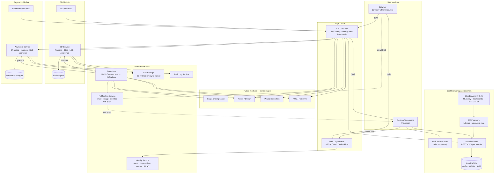
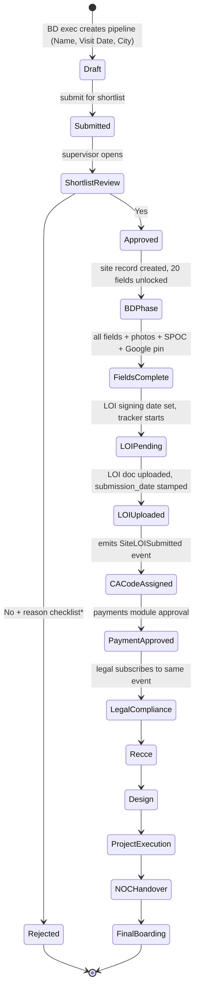
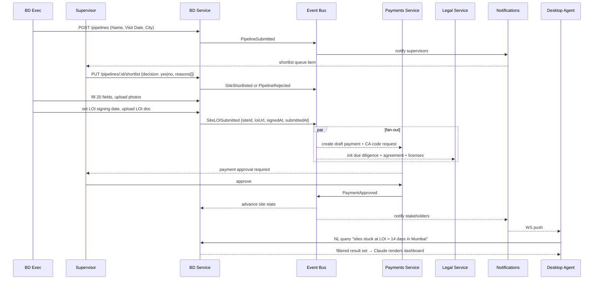

# Blue Tokai Workspace — Architecture & Roadmap

Hybrid product: a constellation of hosted web modules (BD, Payments, Legal,
Project Execution, NOC, …) all sitting behind one auth portal, plus the
Electron desktop app (this repo) acting as an **agentic workspace** on top of
those modules — natural-language Q&A, dashboards, graph rendering, and Skills.

Current build scope: **BD module + Payments module**. Architecture is designed
so the remaining modules from the whiteboard (Legal, Recce, Design, Project Ex,
NOC, Final Boarding) plug in without rework.

---

## 1. Big picture — three planes

- **Web plane**: each module is a hosted web app (its own SPA + backend + DB).
  This is the primary UI for data entry, approvals, uploads.
- **Platform plane**: shared services that everything depends on — identity,
  API gateway, event bus, file storage, notifications, audit.
- **Desktop plane**: the Electron workspace. **Not** a UI mirror of the
  modules. It connects to module backends scoped by the logged-in user's
  role/tenant, and provides Claude-driven NL queries, dashboards, and agentic
  tasks via MCP servers.

---

## 2. Architecture diagram



---

## 3. BD site state machine (notebook page)

Each blue dot on the whiteboard is one of these transitions — RBAC gated.



*Reasons checklist: High Rent · High Cannibalisation · Affluence Problem ·
High Traffic Problem · No Visibility · Sales Problem · Others (free text).

---

## 4. Cross-module event flow



---

## 5. Roles & RBAC (starting matrix)

| Capability                       | BD Exec | BD Supervisor | Finance Approver | CA (external) | Legal | Admin |
|----------------------------------|---------|---------------|------------------|---------------|-------|-------|
| Create pipeline draft            | ✓ own   | ✓             | –                | –             | –     | ✓     |
| Approve shortlist (Yes/No)       | –       | ✓             | –                | –             | –     | ✓     |
| Edit BD 20 fields                | ✓ own   | ✓ all         | –                | –             | –     | ✓     |
| Upload LOI                       | ✓ own   | ✓             | –                | –             | –     | ✓     |
| See SPOC + LOI tracker           | own     | ✓             | ✓                | own           | ✓     | ✓     |
| Submit CA code                   | –       | –             | –                | ✓ own         | –     | ✓     |
| Approve payment                  | –       | –             | ✓                | –             | –     | ✓     |
| Trigger legal due diligence      | –       | –             | –                | –             | ✓     | ✓     |
| Query data via desktop agent     | scoped  | scoped        | scoped           | scoped        | scoped| all   |

Identity service owns this matrix. Every module enforces server-side; the
desktop is **never** the trust boundary.

---

## 6. Data model — first cut

### BD module
- `pipelines` — id, tenant_id, name, visit_date, city, created_by, state, created_at
- `shortlist_decisions` — pipeline_id, decided_by, decision, reasons[], note, decided_at
- `sites` — id, pipeline_id, model, spoc_name, spoc_phone, google_pin,
  score, estimated_sales, nearest_starbucks_sales, nearest_twc_sales,
  carpet_area, cam, rent, cadexp, security_deposit, brokerage,
  escalation_pct, rent_free_days, lockin_tenure_months,
  total_op_cost (generated column = (rent + cam) * 1.18), state
- `site_photos` — site_id, storage_ref (S3), onedrive_ref, uploaded_by
- `loi_records` — site_id, signing_date, submission_date, doc_ref,
  approver_id, approval_state
- `site_audit_log` — site_id, actor, action, before, after, at

### Payments module
- `payments` — id, site_id (logical FK via event), ca_code, amount,
  kyc_doc_ref, approval_state, approver_id, created_at, decided_at
- `payment_audit_log`

Both DBs are physically separate. Cross-module joins happen via events +
materialised views in the desktop SQLite cache, not direct DB joins.

---

## 7. Desktop integration (this repo)

Existing pieces to reuse — don't rebuild:

| Existing | Reuse for |
|----------|-----------|
| `src/main/db/database.ts` (better-sqlite3) | Add `bt_sites`, `bt_payments`, `bt_outbox` tables for cache + offline queue |
| `src/main/remote/` gateway + channels | New `BlueTokaiChannel` for WS push from Notification service |
| `src/main/config/` + electron-store | New auth namespace for portal tokens (per workspace/tenant) |
| `src/preload/index.ts` IPC bridge | Add `electronAPI.blueTokai.*` namespace |
| `scripts/bundle-mcp.js` | Bundle `bd-mcp` and `payments-mcp` servers |
| Skills system | PPTX/XLSX dashboards over module data |
| `src/renderer/store/` (Zustand) | Workspace + module slices |

New main-process additions:

```
src/main/blue-tokai/
├── auth.ts                 # OAuth device flow vs portal, token refresh
├── clients/
│   ├── bd-client.ts        # REST + WS to BD service via gateway
│   └── payments-client.ts
├── sync/
│   ├── outbox.ts           # offline writes drained on reconnect
│   └── pull.ts             # incremental pulls into SQLite cache
└── mcp/
    ├── bd-mcp.ts           # tools: list_sites, sites_by_state, loi_pending_over,
    │                       #        update_site_field (RBAC enforced server-side)
    └── payments-mcp.ts     # tools: list_payments, pending_approvals, approve_payment
```

The agent does **not** call module APIs directly; it goes through the MCP
servers above, which call the module clients, which go through the gateway.
That gives one audit trail and one RBAC enforcement point.

---

## 8. Roadmap

### Phase 0 — Foundation (3–4 weeks)
- Monorepo: Turborepo. Apps `portal`, `bd-web`, `payments-web`. Services
  `identity`, `bd-api`, `payments-api`. Shared packages `ui`, `auth-sdk`,
  `event-types`, `rbac`.
- Stack: Next.js 14, NestJS or Fastify, Postgres + Prisma, Redis Streams,
  S3 (MinIO in dev) + OneDrive sync worker, Traefik gateway.
- Identity: users, orgs, roles, JWT issuance, OAuth device-flow endpoint
  for desktop, RBAC policy engine.
- Audit middleware + central log table.
- docker-compose for local dev (postgres + redis + minio + traefik).

### Phase 1 — BD MVP: pipeline + shortlist (3 weeks)
- BD Web SPA: login via portal, create pipeline, view own pipelines.
- Supervisor view: shortlist queue, Yes/No + reason checklist.
- `PipelineSubmitted`, `SiteShortlisted`, `PipelineRejected` events.

### Phase 2 — BD full: 20-field form + LOI tracker (3–4 weeks)
- 20-field site form, computed fields (`total_op_cost`, escalation, etc.).
- Photo + LOI upload to S3; one-way OneDrive mirror via worker.
- LOI tracker dashboard (days since signing) for supervisor.
- `SiteLOISubmitted` event.

### Phase 3 — Payments module (3 weeks)
- Subscribes to `SiteLOISubmitted` → draft payment.
- CA code linkage, payment amount, KYC upload, approval workflow.
- `PaymentApproved` / `PaymentRejected` events.

### Phase 4 — Desktop integration (2–3 weeks)
- Add `src/main/blue-tokai/` as above.
- New renderer pages: workspace switcher, sites browser, payments queue.
- IPC under `electronAPI.blueTokai.*`.
- WS push from Notification service into existing remote channel system.

### Phase 5 — Agent + MCP + dashboards (2 weeks)
- `bd-mcp` and `payments-mcp` servers bundled via existing
  `scripts/bundle-mcp.js`.
- Skills: "site report PPTX", "payments dashboard XLSX", "pipeline funnel".
- NL query surface in renderer → agent → MCP → module → result → render.

### Phase 6 — Hardening + next modules (ongoing)
- Multi-tenant isolation tests, E2E per workflow, OpenTelemetry + Sentry.
- Add Legal, Recce, Design, Project Ex, NOC modules — each follows the same
  shape (web SPA + service + DB + events + MCP). No platform changes.

---

## 9. Decisions to lock before Phase 0

1. **Hosting** — AWS (EKS + RDS + S3) vs. Vercel + Supabase + Upstash
   (faster to start, less ops). My recommendation: start on the latter,
   migrate the stateful services to AWS only when scale demands it.
2. **OneDrive** — Microsoft Graph integration directly in modules, or a
   sync worker behind S3? Recommend the worker — modules stay clean and
   don't depend on Graph being up.
3. **Event bus** — Redis Streams to start (cheap, fast, already needed for
   cache), Kafka when fan-out exceeds 4–5 modules.
4. **Design system** — one shared `ui` package across all module SPAs so
   the desktop renderer can reuse the same components when it embeds module
   data views.
5. **Tenancy model** — single DB per service with `tenant_id` column +
   row-level security, vs. DB-per-tenant. Start with the former.
